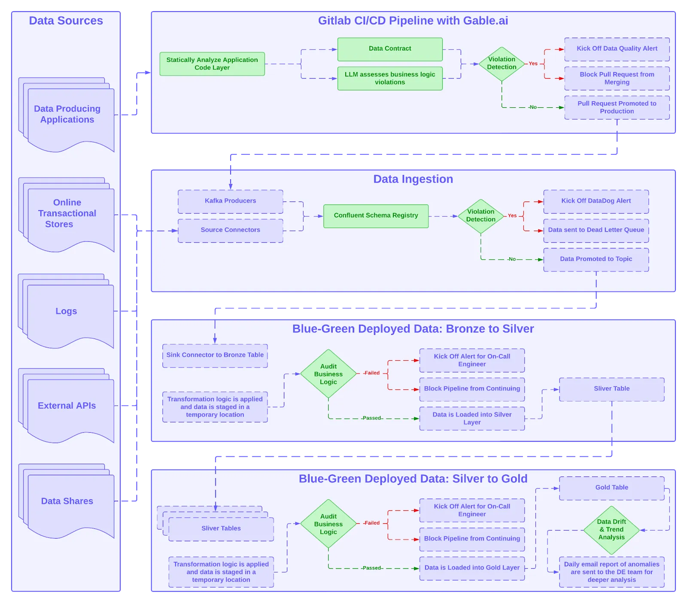

Data Release Life Cycle
=======================

# Table of Content (ToC)
* [Overview](#overview)
  * [Other repositories of Data Engineering helpers](#other-repositories-of-data-engineering-helpers)
* [Articles](#articles)
  * [Database Migration Terminology 101](#database-migration-terminology-101)
  * [Data Quality at Petabyte Scale: Building Trust in the Data Lifecycle](#data-quality-at-petabyte-scale-building-trust-in-the-data-lifecycle)
  * [Testing, Monitoring, and Observability](#testing-monitoring-and-observability)
  * [Dev/Stage/Prod is the Wrong Pattern for Data Pipelines](#devstageprod-is-the-wrong-pattern-for-data-pipelines)
  * [Putting the Write\-Audit\-Publish Pattern (WAP) into Practice with lakeFS](#putting-the-write-audit-publish-pattern-wap-into-practice-with-lakefs)
  * [How to Implement Write\-Audit\-Publish (WAP)](#how-to-implement-write-audit-publish-wap)
  * [Virtual Data Environments](#virtual-data-environments)
* [Books](#books)
  * [Continuous Delivery](#continuous-delivery)
* [Frameworks / tools](#frameworks--tools)
  * [LakeFS](#lakefs)

Created by [gh-md-toc](https://github.com/ekalinin/github-markdown-toc.go)

# Overview
[This project](https://github.com/data-engineering-helpers/data-life-cycle)
intends to document requirements and referential material about data life cycle,
in particular to differentiate it from the
[software delivery life cycle (SDLC)](https://martinfowler.com/delivery.html).

Even though the members of the GitHub organization may be employed by some companies,
they speak on their personal behalf and do not represent these companies.

## Other repositories of Data Engineering helpers
* [Data Engineering Helpers - Knowledge Sharing - Data contracts](https://github.com/data-engineering-helpers/data-contracts)
* [Data Engineering Helpers - Knowledge Sharing - Data products](https://github.com/data-engineering-helpers/data-products)
* [Data Engineering Helpers - Knowledge Sharing - Data quality](https://github.com/data-engineering-helpers/data-quality)
* [Data Engineering Helpers - Knowledge Sharing - Data pipeline deployment](https://github.com/data-engineering-helpers/data-pipeline-deployment)
* [Data Engineering Helpers - Knowledge Sharing - Data lakehouse](https://github.com/data-engineering-helpers/data-lakehouse)
* [Data Engineering Helpers - Knowledge Sharing - Data management](https://github.com/data-engineering-helpers/data-management)
* [Data Engineering Helpers - Knowledge Sharing - Metadata](https://github.com/data-engineering-helpers/metadata)
* [Data Engineering Helpers - Knowledge Sharing - Architecture principles](https://github.com/data-engineering-helpers/architecture-principles)
* [Data Engineering Helpers - Knowledge Sharing - Semantic layer](https://github.com/data-engineering-helpers/semantic-layer)

# Articles

## Data virtualization
* Date: Aug. 2025
* Author: Mariusz Kujawski
  ([Mariusz Kujawski on LinkedIn](https://www.linkedin.com/in/mariusz-kujawski-de))
* Link to the post on LinkedIn:
  https://www.linkedin.com/posts/mariusz-kujawski-de_datavirtualization-dataengineering-dataengineerdiary-activity-7360591974363553793-1FJV/
* 

## Database Migration Terminology 101
* Title: Database Migration Terminology 101
* Date: Feb. 2025
* Author: Tom Baeyens
* Link to the post on LinkedIn:
  https://www.linkedin.com/posts/tombaeyens_database-migration-terminology-101-source-activity-7297573805609156609-ZrQW/

## Data Quality at Petabyte Scale: Building Trust in the Data Lifecycle
* Title: Data Quality at Petabyte Scale: Building Trust in the Data Lifecycle
* Date: Feb. 2025
* Author: Zakariah Siyaji
  ([Zakariah Siyaji on LinkedIn](https://www.linkedin.com/in/zakariah-siyaji/),
  [Zakariah Siyaji on Medium](https://medium.com/@zaki.siyaji))
* Link to the post on LinkedIn by Chad Sanderson:
  https://www.linkedin.com/posts/chad-sanderson_many-companies-talk-about-implementing-data-activity-7296212049565515777-dnCn/
* Link to the article on Medium:
  https://medium.com/glassdoor-engineering/data-quality-at-petabyte-scale-building-trust-in-the-data-lifecycle-7052361307a4
  * 
  * 
* Also referenced in
  [Data Engineering Helpers - Knowledge Sharing - Data contracts](https://github.com/data-engineering-helpers/data-contracts?tab=readme-ov-file#data-quality-at-petabyte-scale-building-trust-in-the-data-lifecycle)

## Testing, Monitoring, and Observability
* Title: The Data Engineer’s Guide to Testing, Monitoring, and Observability
* Date: Dec. 2024
* Author: Alex Caruso
  ([Alex Caruso on LinkedIn](https://www.linkedin.com/in/alexander-caruso/),
  [Alex Caruso on Airbyte blog](https://airbyte.com/blog-authors/alex-caruso))
* Link to the article: https://airbyte.com/blog/the-data-engineers-guide-to-testing-monitoring-and-observability
* Publisher: Airbyte blog

## Dev/Stage/Prod is the Wrong Pattern for Data Pipelines
* Title: Dev/Stage/Prod is the Wrong Pattern for Data Pipelines
* Date: 2 Aug. 2023
* Publisher: [Enigma engineering blog](https://enigma.com/blog/topic/engineering)
* Link to the article:
  https://enigma.com/blog/post/dev-stage-prod-is-the-wrong-pattern-for-data-pipelines

## Putting the Write-Audit-Publish Pattern (WAP) into Practice with lakeFS
* Title: Putting the Write-Audit-Publish Pattern into Practice with lakeFS
* Date: June 2023
* Author: [Robin Moffatt](https://www.linkedin.com/in/robinmoffatt/)
* Link to the article:
  https://lakefs.io/blog/write-audit-publish-with-lakefs/
* Publisher: LakeFS

## How to Implement Write-Audit-Publish (WAP)
* Title: How to Implement Write-Audit-Publish (WAP)
* Date: May 2023
* Author: [Robin Moffatt](https://www.linkedin.com/in/robinmoffatt/)
* Link to the article:
  https://lakefs.io/blog/how-to-implement-write-audit-publish/
* Publisher: LakeFS

## Virtual Data Environments
* Title: Virtual Data Environments
* Date: 18 April 2023
* Author: [Iaroslav Zeigerman](https://www.linkedin.com/in/izeigerman/)
* Link to the article:
  https://tobikodata.com/virtual-data-environments.html
* Publisher: [Tobiko Data](https://tobikodata.com/)

# Books

## Continuous Delivery
* Title: Continuous Delivery: Reliable Software Releases through Build, Test, and Deployment Automation
* Authors: Jez Humble and David Farley
  + Foreword by [Martin Fowler](https://martinfowler.com/)
* Date: 27 Jul. 2010
* ASIN:‎ 0321601912
* Publisher: ‎Addison-Wesley Professional; 1st edition
* ISBN-10: ‎ 9780321601919
* ISBN-13: ‎ 978-0321601919
* Link to the book home page:
  https://martinfowler.com/bliki/ContinuousDelivery.html

# Frameworks / tools

## LakeFS
* Home page: https://github.com/treeverse/lakeFS

lakeFS is an open-source tool that transforms your object storage into a Git-like repository.
It enables you to manage your data lake the way you manage your code.

With lakeFS you can build repeatable, atomic, and versioned data lake
operations - from complex ETL jobs to data science and analytics.

lakeFS supports AWS S3, Azure Blob Storage, and Google Cloud Storage as its underlying storage service.
It is API compatible with S3 and works seamlessly with all modern data frameworks such as Spark,
Hive, AWS Athena, DuckDB, and Presto.

For more information, see the [documentation](https://docs.lakefs.io/).

